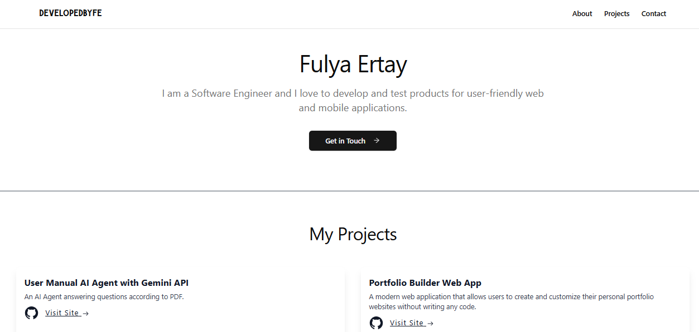

## [Live Link](https://fulyaertay.netlify.app/)

This is my personal portfolio page. It's a single-page website that shows my personal projects and coding knowledge. I've built this page using NextJS and TailwindCSS. It is a fully responsive website for mobile devices. You can see the source code of this page here on GitHub.

## 🛠 Use To Built

 

 

## 💻 Features

- List My Projects
- My Resume Link
- My About
- Contact Info
- Fully Responsive
- Cross Platform

## 🚀 About Me

I'm Fulya Ertay.

I am a junior front-end developer building full-stack applications & learning new technologies. I am proficient in HTML, CSS, JavaScript and have working knowledge of ReactJS. I am passionate about creating user-friendly websites and web applications that are easy to use. My goal is to be able to build applications that are fast, responsive, and fun to use.

### 🔗 You Can Follow Me

This is a [Next.js](https://nextjs.org/) project bootstrapped with [`create-next-app`](https://github.com/vercel/next.js/tree/canary/packages/create-next-app).

The easiest way to deploy your Next.js app is to use the [Vercel Platform](https://vercel.com/new?utm_medium=default-template&filter=next.js&utm_source=create-next-app&utm_campaign=create-next-app-readme) from the creators of Next.js.

Check out our [Next.js deployment documentation](https://nextjs.org/docs/deployment) for more details.
